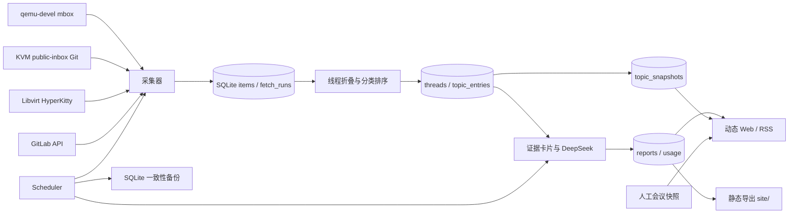

# virt-report 项目复盘

> 记录范围：2026-07-13—2026-08-01  
> 状态：已完成从原型到可持续运行产品的 0→1 建设，并部署于 [virt.taifua.com](https://virt.taifua.com/)。  
> 用途：沉淀建设过程、关键决策、踩坑与可复用方法，为其他社区、行业或技术动态跟踪项目提供参考。

## 1. 结论：这是不是一个“从 0 开始”的项目

如果以“存在代码或页面”为标准，最初并非空目录；但如果以“数据可信、能够自动运行、结果可读、可以部署维护”为标准，virt-report 确实完成了从 0 到 1。

第一轮评估时，最核心的问题不是页面，而是数据源，尤其是 KVM 与 Libvirt：有的源只暴露很小的最新窗口，有的第三方归档丢失邮件头或时间语义，有的接口并不代表项目真实开发流程。没有可靠数据，即使 AI 总结和 UI 再精致，也只是对不完整输入的再加工。

因此项目实际经历的是：

```text
数据源不可控、页面原型
        ↓
多源增量采集与统一数据语义
        ↓
线程折叠、分类、排序与证据卡片
        ↓
受约束的 AI 日报 / 周报 / 月报
        ↓
专题、RSS、会议观察与运行指标
        ↓
Docker 自动调度、备份、健康检查与生产部署
```

Git 历史从 2026-07-13 的初始化提交到 2026-08-01 的会议档案扩展，共形成 19 个聚焦提交。它已不是一次性生成静态 HTML 的脚本，而是一套可持续运行的虚拟化社区动态系统。

## 2. 最终形成了什么

### 2.1 用户可见能力

- 中文日报、自然周周报和自然月月报，并提供独立归档与详情路由。
- QEMU、KVM、Libvirt 三项目概览、具体议题、影响判断和后续观察。
- 功能、缺陷、其他分类，以及 x86、Arm 等架构标签和优先展示。
- 热迁移、热升级、热插拔、启动与生命周期、性能、安全与漏洞等专题。
- 首页分别显示最近 15 期日报、9 期周报和 6 期月报，配合日、周、月切换日历查找历史内容。
- 报告 RSS、KVM Forum 历年点评和学术会议技术演进。
- 受密钥保护的运行状态页，展示采集质量、报告状态、Token 与估算成本。
- PC 与移动端响应式界面、统一品牌 Logo/Favicon、关于页和更新记录。

### 2.2 系统能力

- 五类实际数据流：qemu-devel、KVM、libvirt-devel、QEMU GitLab、Libvirt GitLab。
- SQLite 幂等存储、游标、线程物化、报告、专题快照、调度记录和会议目录。
- DeepSeek 兼容 API、思考模式、JSON 输出、降级模板和调用量记录。
- Web 与 Scheduler 双容器，共享持久化 `data/`，支持服务器重启自动恢复。
- 每 4 小时采集，每日/每周/每月生成报告，每日创建一致性数据库快照。
- 动态页面读取 SQLite；`site/` 同时保留可部署、可审阅的静态快照。
- `/healthz`、`/readyz`、受保护详细状态 API、任务超时、重试和进程锁。

### 2.3 2026-08-01 线上数据快照

以下只是当时部署检查值，运行后会持续增长：

| 数据源 | 已保存条目 |
|---|---:|
| qemu-devel | 54,120 |
| KVM 邮件列表 | 27,557 |
| libvirt-devel | 3,776 |
| QEMU GitLab | 1,270 |
| Libvirt GitLab | 116 |

此外，KVM Forum 已整理 2010—2025 年议程；学术会议观察覆盖 2010—2026 年，首批公开快照包含 82 个经人工复核的虚拟化相关议题。

## 3. 当前架构



代码按职责拆分：

- `virt_report/collectors/`：数据源适配和完整性判断。
- `virt_report/processing/`：线程、架构、变更类型、排序和专题快照。
- `virt_report/summarize/`：证据构造、提示词、模型调用和结果校验。
- `virt_report/render/`：Jinja2 模板、CSS、JavaScript 和静态导出。
- `virt_report/server.py`：动态路由、RSS、指标鉴权、缓存与安全头。
- `virt_report/scheduler.py`：带时区的任务调度、补跑、重试和运行记录。
- `virt_report/conferences.py`：会议元数据目录、候选筛选与人工复核快照。

## 4. 建设阶段

### 阶段一：建立可信采集与报告主链路

首个版本一次性搭建了配置、SQLite、采集器、线程处理、排序、DeepSeek、Jinja2 和 CLI。最重要的不是代码量，而是把流程拆成可单独验证、可以重复运行的层级。

核心原则是：采集结果先落库，报告从数据库重建；模型调用不是数据入口，也不直接控制来源 URL。

### 阶段二：从单页报告变成站点

新增首页、报告页、归档页和关于页，统一命名为 `virt-report`，逐步去掉搜索、同步条、深色模式等当时没有实际价值的元素。文案也从偏宣传式表达改为事实导向，例如“日报 / 周报 / 月报”“统计”“概览”“数据来自社区，分析仅供参考”。

这一阶段确定了一个长期有效的产品原则：只是使用 AI 做整理，就不应把产品描述成“洞察一切”或“消除社区噪声”。克制的文案有助于用户正确理解内容边界。

### 阶段三：自动化、专题与 KVM Forum

加入 Docker、常驻调度器、专题页、独立归档和 KVM Forum。此时系统已能按时间自动生成报告，但生产部署暴露了采集成本、首次启动补跑、任务重叠和静态页面更新等问题。

### 阶段四：生产可靠性

围绕真实服务器部署进行整改：

- mbox 本地缓存和 HTTP Range 增量追加。
- 首次启动不自动回放历史任务。
- 报告任务使用 `--no-fetch`，采集与总结不再重复下载。
- 采集器和调度器增加文件锁。
- 增加任务超时、失败/降级重试和 `scheduler_runs`。
- 增加一致性备份、恢复校验、日志轮转和健康检查。
- Docker 构建默认使用适合中国大陆网络的镜像，可通过环境变量覆盖。

### 阶段五：专题质量与可观测性

专题最初直接聚合大量日报条目，条目数迅速膨胀，失去了“汇总”的意义。后续改成分层模型：周报/月报中的内容构成长期精选，最近 14 天日报只作为近期观察；首页每个专题只展示重点条目，详情页再分页浏览。

同时加入 RSS、运行指标、模型成本估算和访问密钥。运行状态入口放在页脚，但详细采集状态和模型用量不公开暴露。

### 阶段六：移动端、品牌与信息密度

移动端优化不是简单隐藏内容，而是重新安排信息密度：

- 首页按更新频率保留 15 期日报、9 期周报和 6 期月报，通过 Tab 切换类别。
- 日历保持默认展开，避免用户不知道历史内容从哪里查找。
- 保留滚动条，明确告知可横向或纵向浏览。
- 长期演进概述等有信息量的内容不折叠。
- 对标题、标签、URL 等加入 `min-width: 0` 和自动换行，消除横向溢出。

Logo 最终采用“外层 V 包含内层 v”的宿主机/虚机关系，并统一标题图标和 Favicon 的绿色背景、清晰度与尺寸。

### 阶段七：离线快照与会议技术演进

专题页曾在每次请求时重新扫描和计算，数据稍大便出现明显延迟。最终把分类、版本链和报告证据关联移到离线刷新，Web 请求只读取 `topic_snapshots`。

会议模块则将 KVM Forum 升级为统一“会议”入口，并增加系统领域学术会议观察。KVM Forum 只读议程标题，不读 PPT；学术会议保存标题和可用的公开简介/摘要，不读论文 PDF。跨年度演进与中文点评采用人工维护，因为这是低频、高价值、需要长期一致判断的内容，不适合无人审核地批量生成。

## 5. 数据源：最关键、也最容易低估的部分

### 5.1 先定义“完整”，再写采集器

一个 HTTP 请求成功不等于一次采集完整。每个源都需要明确：

| 语义 | 必须回答的问题 |
|---|---|
| 身份 | 哪个字段能长期唯一标识条目？ |
| 时间 | 用创建时间、更新时间还是最近活动时间？ |
| 线程 | 如何找到父邮件、根消息和补丁系列？ |
| 游标 | 下次从哪里继续？ |
| 完整性 | 分页上限、窗口上限或单端点失败时是否允许推进水位？ |
| URL | 哪个地址是用户可访问的原始证据？ |

项目最终使用 `(source, project, native_id)` 唯一标识条目，并引入 `activity_at`：邮件使用发信时间，GitLab 使用最近活动时间。采集成功但分页被截断时，运行记录可为部分完成，但不能把数据水位推进为“已完整同步”。

### 5.2 qemu-devel：整月 mbox 与慢速首次下载

GNU 月度 mbox 的优点是完整、无反爬、保留 `Message-ID` 和 `In-Reply-To`；缺点是当前月文件可达数十 MB。实际服务器国际带宽约 20 KB/s，首次下载 58 MB 曾耗时约 46 分钟。

改进方式：

- 月度文件持久化到 `data/mbox/`。
- 已有缓存请求远端尾部，使用 64 KiB 重叠区校验。
- 重叠一致时只追加新字节；远端前缀变化才完整重下。
- 下载失败但本地有缓存时可读取旧缓存，但标记本轮不完整且不推进水位。
- 历史回填优先在网络更好的机器完成，再通过数据库/缓存快照迁移到服务器。

可复用经验：`--since-days` 能减少解析和入库范围，不一定能减少上游传输量。采集窗口语义和网络传输粒度必须分开描述。

### 5.3 KVM：Atom 最新窗口会静默漏数据

KVM 的 Atom 页面只保留很小的最新窗口，高流量时段会在两次轮询之间丢失邮件。最终改用 lore/public-inbox Git epoch：

- 按时间浅克隆当前 epoch。
- 增量 `fetch` 后读取提交中的原始 RFC822 邮件。
- 保留 Message-ID、父邮件和正文。
- 为时区/提交时间边界多留一天，入库时再按邮件 Date 精确过滤。
- 历史 epoch 使用单独的 `backfill-kvm` 处理。

可复用经验：用于网页阅读的“最新列表”通常不是可靠的数据接口；高流量源要优先寻找不可变日志、归档文件或官方 API。

### 5.4 Libvirt：第三方 RSS 无法承担线程分析

早期第三方归档只提供 RSS 或经过改写的 HTML，真实 Message-ID、父子关系、作者、正文和时间可能不完整。最终使用官方 HyperKitty：

1. 按月归档页发现 thread hash。
2. 通过线程级 REST API 获取邮件元数据和正文。
3. 恢复父子关系与官方线程 URL。
4. 以有限并发拉取正文，避免串行过慢。

另一个实际错误是时间解析最初只按 ISO 处理，而 RSS 使用 RFC822，导致 KVM/Libvirt 历史邮件被误标成“今天”。公共解析器随后同时支持 ISO-8601 与 RFC822，并统一写入 UTC。

### 5.5 GitLab：项目能力不同，不要把预期 403 当故障

QEMU 不使用 GitLab Merge Request，补丁通过 qemu-devel 评审，因此 MR 端点返回 403 是项目能力差异，不是凭据或采集失败。采集器对这个端点明确跳过，但其他必要端点失败或分页被截断时仍不推进完整水位。

可复用经验：数据源适配器不仅要理解 API，还要理解项目工作流；同一种平台上的两个项目也可能具有完全不同的“有效数据”。

## 6. 从邮件到“议题”：处理层的价值

### 6.1 线程优先，而不是消息优先

一组 50 封邮件可能只是同一个补丁系列。如果直接把邮件送给模型，流量最大的系列会垄断报告，用户看到的也只是重复标题。

处理层根据 `In-Reply-To` 和根消息构建线程，GitLab Issue/MR 则天然作为线程。线程物化后保存：消息数、参与人数、首末活动时间、主题类型、项目、URL 和显著性分数。

### 6.2 先规则压缩，再调用模型

模型输入不是原始数据全集，而是经过预筛选的证据卡片：

- 按 QEMU 50%、Libvirt 25%、KVM 25% 分配候选配额。
- 综合活跃度、补丁/RFC、安全信号和项目覆盖排序。
- x86、Arm 相关议题优先，但不因此扩大影响。
- 日报最多 30 条，周报最多 27 条，月报最多 36 条。
- 证据包含首封摘要、最新回复、评审信号、GitLab 状态和架构标签。

这比“利用百万上下文把所有内容塞进去”更可靠。大上下文解决容量问题，不解决噪声、重复和优先级问题。

### 6.3 日报重复不是靠标题去重就能解决

同一补丁或 Issue 可能连续活跃多日。完全去掉会错过新进展，原样保留又会让日报每天重复。

最终策略：

- 查询近 14 期日报中的同 URL 条目。
- 新条目标记 `novelty=new`；已出现条目标记 `novelty=updated`。
- 每期最多保留 5 个持续议题，并保证项目平衡。
- 把上次摘要、上次状态和最新回复同时给模型，要求说明“本次新增了什么”。

这套“实体稳定、事件增量”的方法可直接用于漏洞、项目发布、政策、产品或行业动态跟踪。

## 7. AI 总结：把模型放在证据边界内

### 7.1 主要风险

早期直接将线程文本交给模型会出现几类问题：

- 摘要只是复制邮件正文，尤其是引用链、机器人回复和长结构体。
- 把“提交”“讨论”“评审”“已合并”“已关闭”混为一谈。
- 编造 URL、性能数字、状态或安全影响。
- 把关闭的 Issue 继续描述为“待修复”。
- 日报使用“本周”，周报使用“近期”等周期错位措辞。
- 输出浮夸结论，超过输入证据能够支持的范围。

### 7.2 证据引用机制

每个候选线程由程序分配不可变引用 `T001`、`T002`……。模型只能输出 ref，URL、项目、架构、变更类型和规范化状态由程序根据 ref 回填。

`_sanitize()` 会：

- 丢弃不存在或重复的 ref。
- 阻断模型修改来源 URL 和项目归属。
- 用数据库状态覆盖模型状态。
- 对 closed 项目移除“待修复”等冲突表述。
- 固定 QEMU、KVM、Libvirt 概览结构。
- 校验分类并限制总条数。

这是项目中最值得复用的设计之一：让模型负责语言组织与有限判断，让程序负责身份、状态、链接和访问边界。

### 7.3 提示词不是营销文案

最终提示词明确要求：

- 只依据证据卡片。
- 区分事实、影响和后续观察。
- Patch series 作为一个事件。
- 标题可以克制地中文化，但保留技术名词。
- 安全与数据损坏风险优先；技术影响相近时再优先 x86/Arm。
- 证据不足时明确写“未观察到显著动态”。
- 只输出结构化 JSON。

没有 API Key 或模型失败时，系统生成可识别的“降级模板”，但调度器不会把降级报告当作成功完成，而会按策略重试。

### 7.4 模型升级策略

模型配置集中在 `config.yaml`。2026-08-01 起，新报告统一使用 `deepseek-v4-flash`；历史报告保留生成时内容和模型记录，不为“统一”而改写历史。这既保持可追溯性，也避免重新调用产生不必要成本和结论漂移。

## 8. 专题系统：从 527 条堆积到分层汇总

### 8.1 为什么日报不能直接成为长期专题

日报偏向“今天发生了什么”，专题偏向“这个领域长期值得看什么”。把所有日报条目直接累计，会产生大量版本重复、普通补丁和短期噪声，专题很快失去入口价值。

最终分为：

- **汇总精选**：至少进入周报或月报的议题，作为长期主体。
- **近期观察**：最近 14 天日报的新进展，避免等待下一个周报才出现。
- **专题首页**：每类最多 8 条重点内容。
- **专题详情**：支持重点/最新排序，默认每页 10 条，可切换为 20 或 30 条。

补丁系列会合并版本，优先展示最新版本，并提示报告收录版本与当前版本的差异。

### 8.2 安全专题必须比普通关键词更严格

最初将“安全增强”、机密计算能力、普通固件补丁和真实漏洞混在一起，会使“安全与漏洞”失去含义。

最终公开层只包含：

- 明确 CVE。
- 原始标题或内容提供强证据的安全缺陷。

SEV、TDX、Arm CCA 等安全能力增强仍可进入日/周/月报和内部专题索引，但不进入公开“安全与漏洞”汇总。CVE 编号只从原始证据提取，不根据 AI 摘要猜测。项目不提供独立安全 RSS，避免让辅助汇总被误认为完整漏洞告警源。

### 8.3 为什么专题必须离线计算

动态请求时扫描数万条线程、合并版本并关联历史报告，曾导致 `/topics.html` 打开很慢甚至超时。一天只更新少数几次的数据，没有理由每次访问都重新计算。

最终使用两层物化：

- `topic_entries`：按线程增量更新的分类索引。
- `topic_snapshots`：离线生成的公开分层、排序和版本链结果。

Web 请求只读快照并做轻量分页；快照缺失时可以使用静态页面，而不是在请求路径偷偷执行重任务。

可复用经验：当内容更新频率远低于读取频率时，应优先“写时计算、读时展示”。

## 9. 页面与交互：有用比“功能看起来多”重要

### 9.1 被删除或弱化的功能

- 静态站点上的搜索没有实际索引能力，删除。
- 同步状态条对普通读者无帮助，删除并转移到受保护运行页。
- 深色模式增加维护面且不是核心需求，删除。
- “阅读 xx”“本期 xx”等重复按钮，删除。
- 卡片右上角无实际含义的箭头，删除。
- 过度宣传式副标题和描述，改为直接说明内容来源与边界。

这些删除并不是功能倒退，而是让页面更诚实、更容易理解。

### 9.2 信息架构调整

- “总览”改为“首页”。
- “最近日报 / 周度复盘 / 月度趋势”改为“日报 / 周报 / 月报”。
- “三项目速览”改为“概览”，“本期数据”改为“统计”。
- KVM Forum 与学术会议归入统一“会议”入口。
- “查看年度点评”统一为“查看技术演进”。
- “查看全部议题”改为更准确的“查看相关议题”。

### 9.3 卡片密度与历史查找

报告卡片最初占用面积大、空白多，数据达到数百期后难以浏览。最终将日期和报告类型放在同一行，类型字号与日期平衡；首页按日、周、月的更新频率分别保留 15、9、6 期，更多内容进入归档和日历。

日、周、月都有独立归档页，周报标题显示自然周区间。所有自然周按站点时区的 ISO 周定义：周一 00:00 到下周一 00:00，右端不包含，避免周与周重叠。

### 9.4 移动端经验

- 不因为屏幕小就随意折叠有信息量的正文。
- Tab 已承担类别切换时，不再重复隐藏每类报告数量。
- 日历是历史查找入口，应保持展开。
- 明确保留滚动条比“为了干净全部隐藏”更易用。
- 所有 Grid/Flex 子项设置正确的最小宽度，长英文标题和 URL 使用 `overflow-wrap`。
- Header、Footer、正文使用同一容器宽度，避免页面切换时视觉跳动。

## 10. 自动化与部署：真实环境暴露的问题

### 10.1 首次启动补跑曾触发昂贵全量任务

早期调度器将 `last_check` 设为当前时间减一天。首次启动会立即回放 24 小时内任务，触发耗时一小时以上的采集；采集尚未结束又撞上下一个 `*/4` 窗口，形成重复任务，日报也被串行阻塞。

最终策略：

- 没有状态文件的新部署只检查当前分钟。
- 已运行实例重启才补查最近 24 小时。
- 每类错过任务只保留最近一次。
- 日/周/月报告固定 `--no-fetch`。
- identity 去重，已有非降级报告直接跳过。
- 文件锁防止多个容器或 cron 同时采集。
- 任务超时一小时，失败/降级最多重试三次。

这里没有选择让多个 SQLite 写任务随意并发。对单机、小规模系统而言，明确串行边界、缩短任务和阻止重复，通常比后台并发更可靠。

### 10.2 源码部署不等于数据部署

`data/` 必须保持不入 Git，源码仓库也不会携带已采集数据。第一次从 GitHub 部署时如果直接空库启动，就会面对大文件下载和历史缺口。

因此生产部署形成两条路径：

1. 推荐从其他实例生成 SQLite gzip 一致性快照，校验 SHA-256 后恢复。
2. 无快照时才冷启动采集，并接受首次 mbox/public-inbox 成本。

备份使用 SQLite Online Backup API，而不是直接复制正在写入的数据库；恢复前执行完整性检查，并自动备份被替换的现有数据库。

### 10.3 中国大陆网络环境

Docker Hub、Debian、PyPI、GitHub、邮件归档和模型 API 的网络质量不同。Compose 为 Python 镜像、Debian Mirror 和 PyPI Index 提供国内默认值，同时允许海外环境通过 `.env` 覆盖。采集缓存和可迁移快照比单纯增加 HTTP 超时更有效。

### 10.4 Web 服务边界

项目的内置 `ThreadingHTTPServer` 适合当前低流量、单机部署，并由 Nginx/Caddy 负责域名和 HTTPS。它已增加请求日志、静态资源缓存、安全头和数据库健康检查，但不是通用高并发应用服务器。若访问量明显增加，应切换到成熟 WSGI/ASGI Server，并保留现有渲染和路由层。

## 11. 可观测性、安全与成本

### 11.1 两种健康检查

- `/healthz`：只判断 Web 和 SQLite 能否访问，适合 Docker 存活探针。
- `/readyz`：检查数据源新鲜度、应有报告是否生成、报告是否为降级结果；公开响应只暴露 `ok/degraded` 和时间。

详细源状态、最近十次采集、报告 Token 和成本通过 `/metrics.html`、`/api/status`、`/api/metrics` 查看，并由 `METRICS_ACCESS_KEY` 保护。浏览器登录使用带签名、限时、`HttpOnly + Secure + SameSite=Strict` 的 Cookie。

### 11.2 成本统计不是账单

系统保存输入/输出 Token，按 `config.yaml` 中的人民币/百万 Token 单价估算趋势。历史模型价格继续保留，避免模型切换后无法解释旧报告。页面明确说明估算不等于供应商账单。

### 11.3 基础 Web 安全

响应包含 CSP、防嵌入、MIME 嗅探保护、Referrer Policy 和 Permissions Policy。`.env`、数据库、缓存和运行状态不进入静态快照，也不提交 Git。

## 12. KVM Forum 与学术会议观察

### 12.1 为什么值得做

日/周/月报反映当下社区活动，会议议程更适合观察几年到十几年的技术重心变化。两者结合后，既能看到“今天在改什么”，也能看到“这个问题为何会演变到今天”。

### 12.2 数据边界

- KVM Forum：2010—2025 年，只读取官方页面演讲标题，不读 PPT 和视频。
- 学术会议：2010—2026 年，采集标题元数据和可用公开简介/摘要，不读取 PDF。
- 原始完整标题目录可落入 SQLite；公开 JSON 只保存人工确认相关的议题。
- 年度点评、阶段演进和代表议题人工维护，不由 DeepSeek 自动批量生成。

2010 年是合理起点：当时嵌套虚拟化、Hypervisor I/O 调度、虚机时间、高可用和跨广域迁移已经形成清晰问题线索，能解释后续 microVM、设备直通、机密虚机和云端协同的来源。早期年度只选择少量代表议题，避免为了“完整”机械堆积。

### 12.3 页面组织

“会议”作为入口，分为 KVM Forum 工程线和学术会议研究线；“查看技术演进”进入年度点评，“查看相关议题”进入可筛选、可分页的条目列表。会议来源默认展开，长期演进概述在移动端也直接显示。

## 13. 踩坑清单

| 现象 | 根因 | 最终处理 | 通用经验 |
|---|---|---|---|
| KVM 数据量明显偏少 | Atom 只有最新小窗口 | public-inbox Git epoch | 最新 Feed 不等于完整增量接口 |
| Libvirt 日期都像今天 | RFC822 被当作 ISO 解析失败 | 统一时间解析并写 UTC | 时间格式必须按源验证 |
| Libvirt 线程无法恢复 | 第三方 RSS 丢邮件头 | 官方 HyperKitty 月归档 + REST | 分析线程必须保留原始身份字段 |
| QEMU MR 端点 403 | 项目本身禁用 MR | 明确跳过该能力 | 先理解项目工作流，再解释 API |
| mbox 首次下载近一小时 | 上游粒度是整月大文件 | Range 追加、缓存、快照迁移 | 解析时间窗不等于网络时间窗 |
| 分页到上限仍推进游标 | 把请求成功当采集完整 | 完整性字段和失败不推进水位 | 游标必须与“完整”绑定 |
| 日报在当天提前生成 | 周期键与生成时间混淆 | 默认生成前一个完整自然日 | 报告周期与生成时间是两个字段 |
| 周报日期相互重叠 | 自定义边界不一致 | ISO 自然周、半开区间 | 所有周期使用统一边界函数 |
| 首次启动立即全量采集 | 调度器默认回放 24 小时 | 新部署仅检查当前分钟 | Catch-up 必须区分首次启动与重启 |
| 采集撞上下一个调度窗口 | 无 identity/锁/超时 | 去重、锁、超时、重试 | 调度器必须假设任务可能超时 |
| 每个页面请求都很慢 | 请求时重建专题和版本链 | 离线快照、读时分页 | 低频更新内容应写时计算 |
| 专题有数百条，重点不突出 | 所有日报无限累计 | 周/月精选 + 14 天观察 | 汇总页不能等同于搜索结果页 |
| 安全专题混入普通增强 | 关键词过宽 | CVE/强缺陷证据白名单 | 安全分类宁缺毋滥 |
| 摘要展示邮件引用和机器人正文 | 直接截原始 excerpt | 技术/风险模板 + 报告证据 | 降级内容也需要可读性设计 |
| 模型编造状态或 URL | 把事实字段交给 LLM | ref 白名单与程序回填 | 模型输出必须经过结构和证据校验 |
| 连续日报重复 | 同一线程持续活跃 | 历史摘要 + 最新变化 + 数量限制 | 区分实体去重与事件更新 |
| 首页数据多后难查 | 大卡片、空白多、无归档 | 紧凑卡片、日/周/月 15/9/6 期、归档、日历 | 首页负责发现，不负责承载全部历史 |
| 移动端横向溢出 | Grid/Flex 子项默认最小宽度 | `min-width:0`、自动换行 | 响应式测试要覆盖真实长标题 |
| 移动端内容被随意折叠 | 将“小屏”误解为“少信息” | 核心内容默认展开 | 折叠应按信息层级，而非屏幕宽度 |
| Logo 与 Favicon 不一致 | 多轮资产独立调整 | 同一绿色底与嵌套 V 语言 | 品牌资产应共用一个视觉源 |
| Git 部署后没有历史数据 | `data/` 正确地未入库 | 备份恢复或冷启动 | 代码发布与运行数据迁移要分开设计 |

## 14. 可复用的“动态跟踪系统”蓝图

这套方法可用于开源社区、漏洞、云原生项目、AI 模型、政策法规、产品发布、研究论文或行业新闻跟踪。

### 14.1 第一步：画数据源契约表

不要先写爬虫。先为每个源记录：

```text
名称 / 官方性 / 唯一 ID / 创建时间 / 活动时间 / 父子关系
分页与窗口上限 / 增量游标 / 完整性判断 / 原始 URL / 限流方式
```

找不到稳定身份和完整性判断的源，只能作为补充信号，不能成为主数据源。

### 14.2 第二步：建立通用数据模型

推荐至少区分：

- `items`：原始事件或消息。
- `threads/entities`：稳定实体和聚合视图。
- `fetch_state`：增量水位。
- `fetch_runs`：一次采集发生了什么。
- `reports`：周期内容及模型用量。
- `topic_entries`：可增量更新的分类索引。
- `topic_snapshots`：公开读取快照。
- `scheduler_runs`：自动任务的真实结果。

如果未来要跟踪 CVE，可把 thread/entity 换成漏洞；跟踪产品发布可换成产品/版本；方法不变。

### 14.3 第三步：把模型输入变成证据卡片

每张卡片只包含生成结论所需字段，并有程序生成的 ref。让模型返回 ref 和自然语言，所有可验证字段由程序回填。提示词应明确：

- 哪些事实不可推断。
- 哪些状态必须区分。
- 什么叫重复事件。
- 本周期允许使用什么措辞。
- 输出 JSON Schema 和条数预算。

### 14.4 第四步：为不同时间尺度设计不同选材

- 日报：新鲜度与新增进展。
- 周报：阶段性结果和跨日归纳。
- 月报：主题演变、持续问题与趋势。
- 专题：长期精选 + 短期观察。
- 年度档案：人工校准的低频高价值总结。

不要只是把日报合并成周报、把周报合并成月报；每个时间尺度应有独立的筛选目标。

### 14.5 第五步：请求路径只做轻工作

采集、分类、版本链、向量化或 LLM 调用都不应发生在普通页面请求中。后台写快照，前台只做读取、过滤和分页。这样更快、更可预测，也更易缓存。

### 14.6 第六步：先做好运行闭环，再增加功能

最小生产闭环应包括：

```text
增量采集 → 完整性记录 → 报告生成 → 降级识别 → 重试
→ 健康检查 → 运行指标 → 一致性备份 → 恢复演练
```

没有这个闭环时，邮件订阅、更多数据源或更漂亮的前端只会扩大维护面。

## 15. 测试与验证方法

当前测试以 `pytest` 为主，提交本次复盘时项目有 74 个自动化测试。重点覆盖：

- ISO/RFC822 时间解析和周期边界。
- 数据库迁移、唯一键与活动时间语义。
- GitLab 分页完整性、HyperKitty 线程身份和 mbox Range 追加。
- 邮件线程根、版本系列和专题安全分类。
- 模型 ref 校验、URL 回填、关闭状态和降级报告。
- 路由、RSS、鉴权、健康检查和静态资源。
- 响应式相关的关键 HTML/CSS 约束。
- KVM Forum 和会议目录的新旧顺序、来源链接与内容边界。

每次明显 UI 调整还会重新导出 `site/`，检查首页、日报、专题、会议、KVM Forum 和关于页截图。生产部署后再验证：Git 提交、Docker 健康状态、`/readyz`、公网 HTTP 状态和关键文本。

仍可加强的部分是浏览器级端到端测试、真实源的定期契约测试、数据库规模性能基准和故障注入。

## 16. 参考资料

### 数据源与项目

- [qemu-devel GNU 归档](https://lists.gnu.org/archive/html/qemu-devel/)
- [KVM lore/public-inbox](https://lore.kernel.org/kvm/)
- [libvirt-devel HyperKitty](https://lists.libvirt.org/archives/list/devel@lists.libvirt.org/)
- [QEMU GitLab](https://gitlab.com/qemu-project/qemu)
- [Libvirt GitLab](https://gitlab.com/libvirt/libvirt)
- [QEMU 官网](https://www.qemu.org/)
- [Libvirt 官网](https://libvirt.org/)
- [KVM 官方文档](https://www.kernel.org/doc/html/latest/virt/kvm/index.html)

### DeepSeek

- [API 文档](https://api-docs.deepseek.com/zh-cn/)
- [更新记录](https://api-docs.deepseek.com/zh-cn/updates/)
- [思考模式](https://api-docs.deepseek.com/zh-cn/guides/thinking_mode)
- [API 定价](https://api-docs.deepseek.com/zh-cn/quick_start/pricing/)

### 会议与长期资料

- [KVM Forum Archive](https://kvm-forum.qemu.org/archive/)
- [OSDI](https://www.usenix.org/conferences/byname/179)
- [SOSP](https://sosp.org/)
- [ASPLOS](https://www.asplos-conference.org/)
- [EuroSys](https://www.eurosys.org/)
- [VEE / SIGOPS Conferences](https://www.sigops.org/conferences/)
- [NSDI](https://www.usenix.org/conferences/byname/178)
- [FAST](https://www.usenix.org/conferences/byname/173)
- [SoCC](https://acmsocc.org/)
- [USENIX Security](https://www.usenix.org/conferences/byname/108)
- [USENIX ATC 历史档案](https://www.usenix.org/conferences/past#atc)

### 博客与辅助阅读

- [Virt Tools Planet](https://planet.virt-tools.org/)
- [QEMU Blog](https://www.qemu.org/blog/)
- [Red Hat Virtualization](https://developers.redhat.com/topics/virtualization/all)
- [Oracle Virtualization Blog](https://blogs.oracle.com/virtualization/)
- [SUSE Blog](https://www.suse.com/c/blog/)

## 17. 尚未完成与不应急着做的事情

- 失败告警尚未接入外部通知；需要先确定实际通知渠道和噪声策略。
- 邮件订阅暂缓。RSS 已能满足低耦合订阅，邮件会引入退订、投递和隐私维护成本。
- 内置 Web Server 适合当前规模；访问量增长后再切成熟应用服务器。
- 学术会议内容需要每年人工增补，不应伪装成完全自动化。
- 专题规则仍需随真实误判调整，尤其是补丁系列跨标题合并和安全分类。
- 运行指标还不是 Prometheus 指标体系，也没有长期趋势图和外部告警。
- 仓库是否公开应在持续运行、文档和安全审查稳定后决定，而不是为了“开源”立即扩大维护承诺。

## 18. 最重要的经验

1. **数据源质量决定上限。** 不完整、无身份、无时间语义的数据无法靠 AI 补救。
2. **线程或实体才是跟踪对象。** 原始消息只是事件证据。
3. **LLM 应消费证据，不应拥有事实。** URL、状态、身份和权限由程序控制。
4. **不同周期需要不同选材逻辑。** 汇总不是简单累加。
5. **低频更新内容应离线计算。** 页面请求不承担采集和重分析。
6. **真实部署是架构评审的一部分。** 带宽、冷启动、重启和数据迁移会暴露本地开发看不到的问题。
7. **克制的产品表达更可信。** 内容边界、数据来源和 AI 局限应直接说明。
8. **移动端不是删减版。** 应重排信息，而不是默认隐藏信息。
9. **可恢复性比一次成功更重要。** 水位、运行记录、锁、重试、备份和就绪检查共同构成自动化。
10. **最有价值的功能往往来自删减。** 删除无效搜索、装饰按钮和重复状态，才能突出真正需要阅读的内容。

virt-report 的最终价值，不只是生成了虚拟化社区报告，而是验证了一条可复用路径：从异构公开数据中建立可信实体和时间语义，用规则与证据约束 AI，再以离线快照、自动调度和可观测部署将结果稳定交付。
