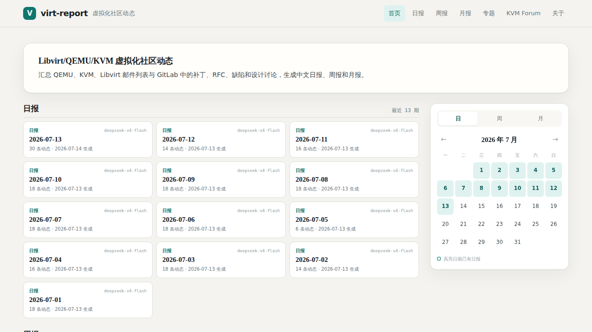
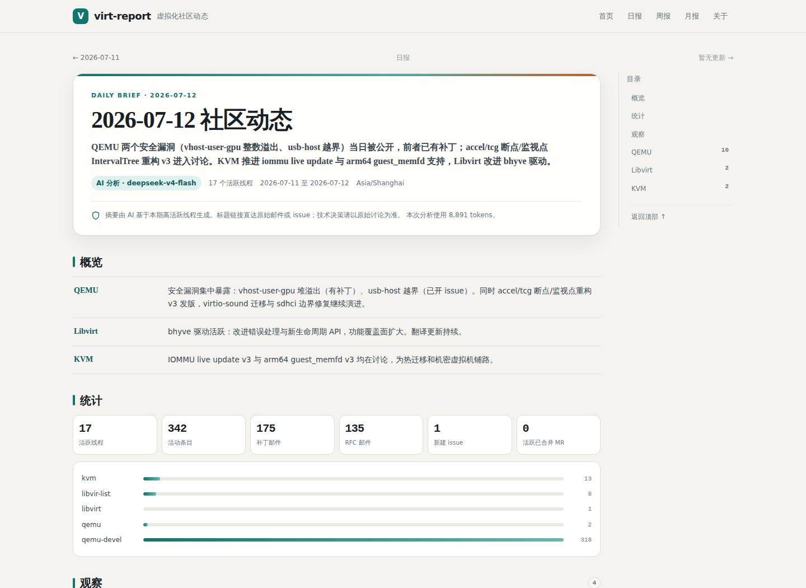
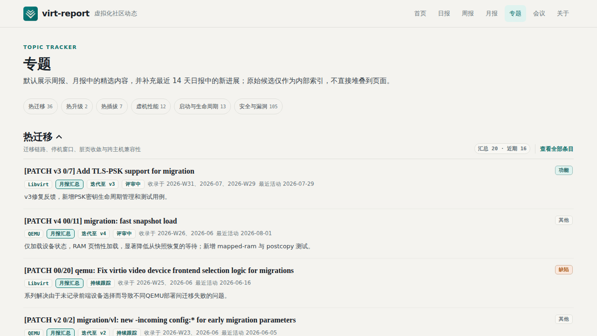
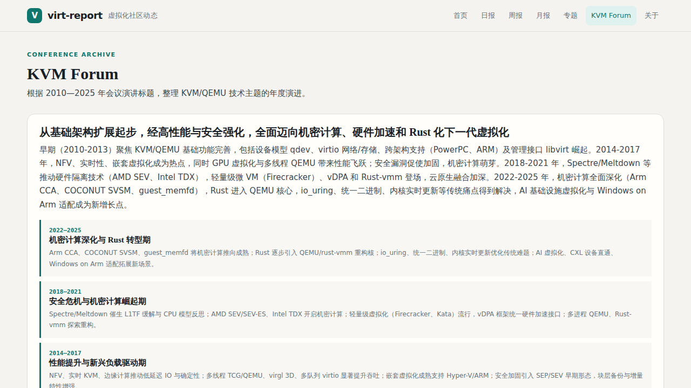
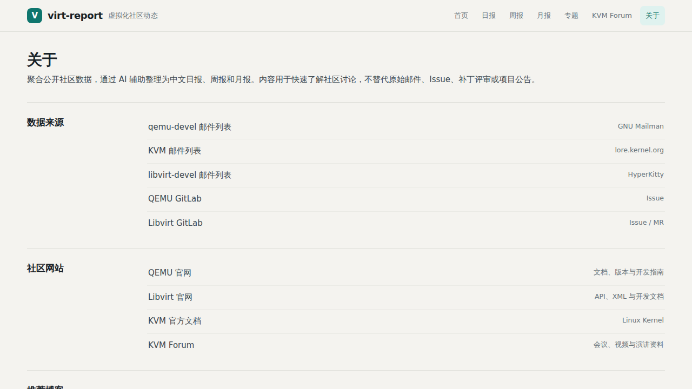

# virt-report

追踪 **libvirt / QEMU / KVM** 社区动态（邮件列表 + GitLab issue/MR），用 LLM 生成**中文**日报 / 周报 / 月报，以简洁的网页形式呈现。

## 界面预览

### 首页

[](docs/images/demo-home.png)

### 日报

[](docs/images/demo-daily.png)

### 专题

[](docs/images/demo-topics.png)

### KVM Forum

[](docs/images/demo-kvm-forum.png)

### 关于

[](docs/images/demo-about.png)

## 数据源（均已验证可用）

| 源 | 地址 | 采集方式 | 历史覆盖 |
|---|---|---|---|
| qemu-devel 邮件列表 | `lists.gnu.org/archive/mbox/qemu-devel/` | 月度 mbox 缓存 + HTTP Range 增量（含 Message-ID/In-Reply-To） | ✅ 完整历史 |
| kvm 邮件列表 | `lore.kernel.org/kvm/git/1.git` | public-inbox Git epoch（按时间浅克隆） | ✅ 当前 epoch；支持历史回填 |
| libvirt 邮件列表 | `lists.libvirt.org` | 官方月归档 + HyperKitty REST API | ✅ 按月回填 |
| libvirt GitLab | `gitlab.com/libvirt/libvirt` | GitLab API v4 (issues / MRs) | ✅ |
| qemu-project GitLab | `gitlab.com/qemu-project/qemu` | GitLab API v4 (issues；MRs 被 QEMU 禁用) | ✅ |

> QEMU 不接受 GitLab MR，所有补丁走 qemu-devel 邮件列表，故 qemu-project 的 MR 端点返回 403（已优雅跳过）。
> **qemu-devel** 用 GNU pipermail 月度 mbox，本地缓存 `data/mbox/`；已有缓存通过 64 KiB 尾部重叠校验后只追加新增字节，校验失败才完整重下。
> **KVM** 不再轮询 `/new.atom` 的 25 条窗口，而是同步 lore/public-inbox Git epoch，保留原始 RFC822 邮件头。日常只按时间浅克隆；`backfill-kvm` 可回填 epoch 0/1。
> **libvirt** 使用官方 HyperKitty：月度页面发现 thread hash，REST API 获取真实 Message-ID、父邮件、作者、正文和线程关系；不再依赖第三方 mail-archive RSS。
> 数据库以 `(source, project, native_id)` 唯一标识条目，并使用 `activity_at` 统一邮件发信时间与 GitLab 最近活动时间。
> 时间解析：`base.parse_dt` 同时支持 ISO 与 RFC822（mail-archive RSS 用 RFC822，曾因只认 ISO 导致 kvm/libvirt 日期全误标今天）。
> DeepSeek V4 使用 `thinking={type:enabled}` + `reasoning_effort=high`；JSON 输出通过不可变 `Txxx` 证据引用回填真实 URL。max_tokens 日 12000 / 周 24000 / 月 32000，并记录实际 usage。

## 架构

```
采集层 (lore/gitlab) ──> SQLite ──> 处理层 (线程折叠/分类/排序) ──> 总结层 (DeepSeek) ──> 渲染层 (Jinja2) ──> site/
```

- **增量 + 幂等**：采集器记录游标，只拉新数据；重跑从 DB 重新生成。
- **线程为中心**：邮件按 `in-reply-to` 链折叠成线程（一个 50 封的 patch series = 1 线程），不按单封邮件。
- **LLM 前置压缩**：日报先按项目分别从 50 个候选线程中取配额（QEMU 50%、Libvirt 25%、KVM 25%），再按显著性排序；最终精选 20–30 条。上下文包含首封、最新回复、评审信号与 GitLab 状态。
- **可观测采集**：`fetch_runs` 记录每个源的请求窗口、覆盖范围、完整性和错误；单源失败不阻断其他源，失败不推进水位。
- **分层专题索引**：原始线程只作为候选池；公开专题以周报/月报精选为长期汇总，并补充最近 14 天日报中的新进展。“安全与漏洞”公开层仅接受完整 CVE 与强漏洞证据，安全能力增强只保留在内部索引和周期报告中。
- **RSS 与运行指标**：报告和安全专题提供 RSS 2.0；运行页展示采集完整性、数据规模、报告 token 与按配置单价估算的成本。
- **降级容错**：未配置 DeepSeek key 时自动走模板降级；调度器不会把降级结果标记为完成，而会按配置重试并留下运行记录。

## 安装

```bash
cd virt_report
python3 -m venv .venv
.venv/bin/pip install -e .
cp .env.example .env   # 填入 DEEPSEEK_API_KEY (可选, 不填则降级)
```

## 使用

```bash
# 采集近 3 天数据 + 重建线程
.venv/bin/virt-report fetch

# 从指定本地日期开始回填（适合补齐历史月报数据）
.venv/bin/virt-report fetch --since 2026-04-01 --max-pages 20

# 检查数据覆盖、最近采集完整性和错误
.venv/bin/virt-report status

# 回填 KVM 历史（跨度大时会下载较大的 Git epoch）
.venv/bin/virt-report backfill-kvm --since 2025-01-01

# 生成前一个完整自然日的日报（采集 -> 处理 -> DeepSeek -> SQLite）
.venv/bin/virt-report daily

# 生成指定日期的日报
.venv/bin/virt-report daily 2026-07-12

# 周报 / 月报（默认生成上一个完整自然周/自然月；可传周期键）
.venv/bin/virt-report weekly
.venv/bin/virt-report monthly 2026-07

# 更新 KVM Forum 2010—2025 演讲标题并用 Pro 模型生成年度主题点评
.venv/bin/virt-report kvm-forum

# 仅用已采集数据重新生成 (不重新采集)
.venv/bin/virt-report daily 2026-07-12 --no-fetch

# 启动数据库驱动的站点（报告按路由即时渲染）
.venv/bin/virt-report serve --host 0.0.0.0 --port 8090

# 启动常驻自动调度器
.venv/bin/virt-report scheduler

# 离线重建专题分类、版本链和报告证据快照
.venv/bin/virt-report topics-refresh

# 导出完整静态快照到 site/（首页为 site/index.html）
.venv/bin/virt-report index

# 创建一致性的 SQLite gzip 快照（同时输出 SHA-256）
.venv/bin/virt-report backup data/backups/virt-report.db.gz

# 停止服务后校验并恢复快照；现有数据库会再自动备份一次
.venv/bin/virt-report restore data/backups/virt-report.db.gz --sha256 <摘要> --force

# 本地预览 Git 中的纯静态站点
.venv/bin/python -m http.server 8091 --directory site
```

日常运行以 SQLite 中的报告为准，Web 服务通过 `/daily/`、`/weekly/`、`/monthly/` 提供独立归档页，并通过对应详情路由即时渲染。专题的分类、版本链合并和报告证据关联会在采集或报告生成后离线写入 SQLite 快照；网页请求只读取快照并完成轻量分页、排序，不会重新扫描原始数据。`/topics.html` 每类最多展示 8 条，先取周报/月报精选，再补最近 14 天日报观察；`/topics/<专题>/` 可在“汇总精选 / 近期观察”之间切换，并支持重点/最新排序及每页 10、20、30 条。需要手动刷新时运行 `virt-report topics-refresh`。采集和 AI 生成不会触发全局 HTML 渲染；只有显式执行 `virt-report index`，或将 `schedule.auto_export` 设为 `true`，才会把完整快照导出到 `site/`。

“安全与漏洞”位于现有专题页首栏，只分为“明确 CVE / 安全缺陷”。分类来自原始线程，不根据 AI 摘要猜测漏洞编号；SEV、TDX、Arm CCA 等安全能力增强仍保留在内部索引和日报、周报、月报中，但不进入安全专题与安全 RSS。专题索引表 `topic_entries` 在采集后增量更新，公开分层结果写入 `topic_snapshots`；Web 请求不会执行索引或版本链重建。

RSS 地址为 `/feed.xml`（全部报告）、`/daily/feed.xml`、`/weekly/feed.xml`、`/monthly/feed.xml` 和 `/topics/security/feed.xml`。页脚“运行状态”进入受保护的 `/metrics.html`，展示各源最近一次及近十次采集状态、数据规模、最近报告和模型用量；`/api/metrics` 提供相同 JSON 数据并接受 `Authorization: Bearer <METRICS_ACCESS_KEY>`。成本依据 `config.yaml` 的人民币/百万 tokens 单价估算，仅供趋势观察，不等同于 DeepSeek 账单。运行页不写入静态快照，避免绕过后端鉴权。

周报严格按站点时区的 ISO 自然周统计，即周一 00:00 至下周一 00:00（右端不包含）；页面以闭区间展示为 `2026 年第 28 周（7.6–7.12）`。`/kvm-forum.html` 仅依据 KVM Forum 2010—2025 各届议程标题归纳年度主题，不读取 PPT 或视频正文；现有分析保留生成时使用的模型，后续重新分析时跟随当前周报模型。

首页的日报、周报和月报各保留最近 15 期，卡片直接显示报告标题；移动端用三类切换，默认每类先显示 5 期，更早内容通过归档页或右侧日、周、月切换器查找。报告详情支持按项目、x86、ARM、功能和缺陷筛选，并继续对重点架构议题进行明确标记和优先展示。

日报最多精选 30 条，而不是简单按邮件数量截取：候选线程先按活跃度、补丁/RFC/安全信号和项目配额排序，再保证 QEMU、Libvirt、KVM 的覆盖，并优先保留 x86、ARM 议题。已在近 14 期日报出现的线程最多保留 5 条，提示词会要求对比上次摘要说明本次进展，减少连续日报重复。周报和月报上限分别为 27、36 条。

## 启用 AI 摘要（DeepSeek）

在 `.env` 中设置 `DEEPSEEK_API_KEY`（获取：https://platform.deepseek.com/）。DeepSeek 走 OpenAI 兼容端点 `https://api.deepseek.com`；自 2026 年 8 月 1 日起，新生成的日报、周报和月报统一使用 `deepseek-v4-flash`。`.env` 由 `load_config()` 自动加载，无需手动 export。无 key 时自动降级为模板摘要并标注「降级模板」徽章。

> `deepseek-v4-flash` 支持 1M 上下文、思考模式和 JSON Output；项目仍限制候选线程数以降低噪声与成本。历史报告保留原有内容和模型记录，配置中继续保留旧模型单价用于成本估算。若模型 ID 变化，调整 `config.yaml` 即可。

## 定时调度

Docker 部署推荐直接启动 Web 与调度器两个服务：

```bash
cp .env.example .env
docker compose up -d --build
```

两个容器共享 `data/`。默认每 4 小时增量采集；每天 00:15 生成前一日日报，周一 00:25 生成上周周报，每月 1 日 00:35 生成上月月报，并在每天 01:05 创建数据库快照。动态 Web 直接读取 SQLite，因此无需每次全量导出静态 HTML。

调度器首次启动只检查当前分钟，不会自动执行昂贵的历史补采；已有调度状态的重启会补查最近 24 小时。周期报告任务固定带 `--no-fetch`，不会在定时采集之外重复下载；每个任务默认最长运行 1 小时，失败或降级结果最多重试 3 次，运行结果写入 `scheduler_runs` 并在受保护的运行页展示。自动快照默认保留 14 天，且只清理 `auto-*.db.gz`，不会删除手工备份。采集器和调度器均有进程锁，重复容器或重叠 cron 会安全失败而不是并行写库。

宿主机 cron 方式仍可使用：

```cron
# 频繁采集（KVM Git 增量、libvirt 官方 API、QEMU mbox/GitLab）
7 */4 * * *   /path/to/virt_report/scripts/run_fetch.sh
# 日报 (基于累积数据生成前一天)
15 0 * * *    /path/to/virt_report/scripts/run_daily.sh
# 周报 (周一生成上周) / 月报 (1 号生成上月)
25 0 * * 1    /path/to/virt_report/scripts/run_weekly.sh
35 0 1 * *    /path/to/virt_report/scripts/run_monthly.sh
```

## 服务器部署

推荐在单台 Linux 服务器上使用 Docker Compose 部署。服务器需要能够访问 GitHub、GitLab、邮件列表、lore.kernel.org 和 DeepSeek API。

```bash
# 私有仓库需要预先配置有读取权限的 SSH Key
git clone git@github.com:taifuer/virt_report.git
cd virt_report

cp .env.example .env
# 编辑 .env，填写 DEEPSEEK_API_KEY 和随机生成的 METRICS_ACCESS_KEY；GITLAB_TOKEN 按需填写。
# 默认 Docker/Python/Debian 镜像适合中国大陆网络，海外环境可在 .env 覆盖。

# 先启动 Web；源码仓库不携带 data/，首次部署需恢复快照或手动初始化
docker compose up -d --build web

# 方案 A：从其他实例取得数据库快照后恢复（推荐，先核对 SHA-256）
docker compose stop web scheduler
docker compose run --rm web virt-report --config /app/config.yaml restore \
  /app/data/backups/virt-report.db.gz --sha256 <摘要> --force

# 方案 B：空库冷启动；首次 mbox 下载可能较久
docker compose run --rm scheduler virt-report --config /app/config.yaml fetch --since-days 4
docker compose run --rm scheduler virt-report --config /app/config.yaml daily --no-fetch

docker compose up -d web scheduler
docker compose ps
docker compose logs -f scheduler
```

Compose 只将 Web 绑定到 `127.0.0.1:8090`，请通过 Nginx/Caddy 暴露域名和 HTTPS。`web` 提供动态页面，`scheduler` 按 `config.yaml` 自动采集并生成日报、周报和月报；两个服务均使用 `restart: unless-stopped`，服务器重启后会自动恢复。SQLite、采集缓存和调度状态持久化在宿主机 `data/`。

存活探针 `/healthz` 仅检查 Web 与数据库可访问；就绪探针 `/readyz` 只公开 `ok/degraded` 和检查时间，并在任一数据源超过 12 小时未成功完整采集、应生成的日报/周报/月报缺失或仍为降级结果时返回 503。详细 `/api/status`、`/api/metrics` 与运行页面均使用 `METRICS_ACCESS_KEY` 保护，浏览器验证成功后的安全 Cookie 默认有效 12 小时。Web 响应默认附带 CSP、防嵌入、MIME 嗅探与 Referrer Policy 等安全头。不要直接复制正在写入的 SQLite 文件。更新部署：

```bash
git pull --ff-only
docker compose up -d --build
docker compose ps
```

若服务器已有部署定制，更新前先执行 `git diff > ../virt-report-deploy.patch` 保存差异，再将必要设置迁移到 `.env`；不要把密钥或 `data/` 提交到 Git。

## 项目结构

```
virt_report/
├── config.yaml                 # 数据源/LLM/调度配置
├── virt_report/
│   ├── config.py  db.py  cli.py
│   ├── collectors/{base,lore,gitlab}.py
│   ├── processing/{threads,classify,rank,architecture,category,topics}.py
│   ├── summarize/{llm_provider,prompts,periods,report}.py
│   ├── render/{render.py, templates/{base,index,report,archive,topics,topic_detail,metrics,kvm_forum,about}.html}
│   ├── kvm_forum.py           # 历年议程标题采集与 Pro 模型主题分析
│   ├── metrics.py  rss.py      # 运行/成本统计与 RSS 2.0 输出
│   ├── scheduler.py           # 容器内自动采集与周期报告调度
│   └── server.py              # SQLite 驱动的动态报告路由
├── Dockerfile  compose.yaml
├── scripts/run_daily.sh
├── data/virt_report.db         # SQLite (gitignore)
└── site/                       # 纳入 Git 的可部署静态站点快照
```

## 路线图

- ✅ **阶段 1 (MVP)**：lore (qemu-devel/kvm) + GitLab (libvirt/qemu) 采集 → SQLite → 线程折叠/排序 → DeepSeek 日报 → 报纸风 HTML。端到端跑通。
- ✅ **阶段 2**：HyperKitty 采集器补 libvirt-devel (RSS+thread hash 折叠 patch series)；通用周期报告生成器；周报；日历导航首页。
- ✅ **阶段 3**：月报；周/月报主题聚类 (LLM 跨源归纳 themes)；cron 全调度 (频繁采集 + 日/周/月报)。
- ✅ **阶段 4**：独立报告归档、原始线程增量专题、安全与漏洞、RSS、运行/成本统计及 Docker 自动调度。
- 🚧 **阶段 5**：已完成专题分层、日报重复抑制、调度记录/重试/自动备份和基础 CI；继续细化 patch series 折叠，并按实际价值扩展高质量数据源。暂不加入邮件订阅。
