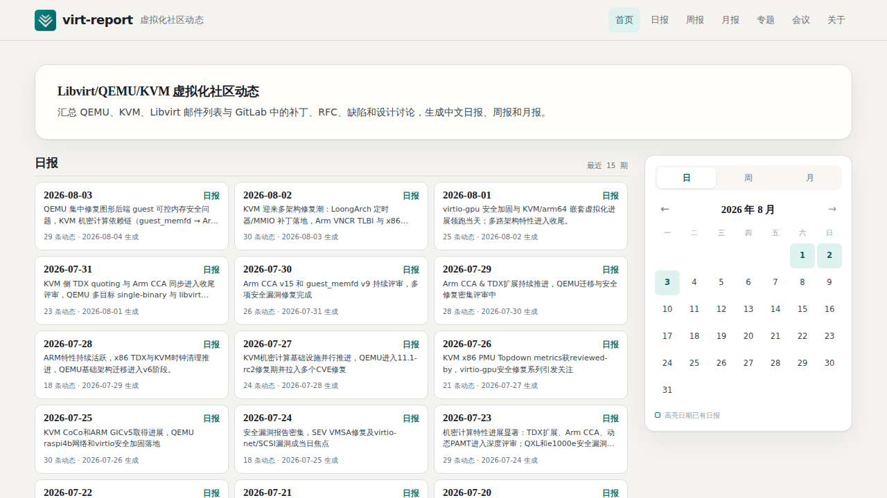
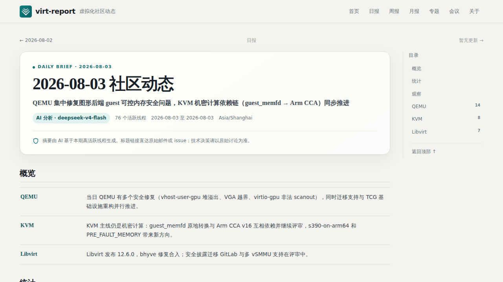

# virt-report

virt-report 聚合 **QEMU / KVM / libvirt** 的邮件列表与 GitLab 动态，通过 AI 辅助整理为中文日报、周报和月报，并提供专题、搜索、会议观察与 RSS。

## 主要功能

- 增量采集 qemu-devel、KVM、libvirt-devel 及 QEMU/libvirt GitLab 活动。
- 按邮件线程折叠补丁与讨论，结合活跃度、项目覆盖和 x86/Arm 关注度筛选议题。
- 使用 DeepSeek 生成带原始证据链接的日报、周报和月报；自动任务在 AI 失败时不发布降级稿。
- 提供专题汇总、中英文搜索、KVM Forum 与学术会议技术演进页面。
- 支持动态 Web、静态快照、RSS、运行指标、自动调度和数据库备份。

内容用于快速了解公开社区讨论，不替代原始邮件、Issue、补丁评审或项目公告。

## 界面预览

### 首页

[](demo/demo-home.png)

### 日报

[](demo/demo-daily.png)

### 专题

[](demo/demo-topics.png)

## 工作流程

```text
邮件列表 / GitLab → 增量采集 → SQLite → 线程重建与分类排序
                                      ↓
                           DeepSeek 点评 → Web / RSS / site/
```

采集器保持幂等，数据库统一保存原始活动、线程、报告与运行状态。网页默认从 SQLite 动态渲染；`site/` 是可独立部署的静态快照。详细设计见[报告与内容模型](docs/REPORTING.md)。

## 快速开始

需要 Python 3.11+；联网采集和 AI 点评还需访问对应数据源与 DeepSeek API。

```bash
git clone https://github.com/taifuer/virt_report.git
cd virt_report
python3 -m venv .venv
.venv/bin/pip install -e .
cp .env.example .env              # 填写 DEEPSEEK_API_KEY

.venv/bin/virt-report fetch --since-days 3
.venv/bin/virt-report daily --no-fetch
.venv/bin/virt-report serve --host 127.0.0.1 --port 8090
```

浏览器访问 `http://127.0.0.1:8090/`。完整命令与历史回填方式见[使用指南](docs/USAGE.md)。

Docker 部署：

```bash
cp .env.example .env
docker compose up -d --build
```

源码不包含 `data/`。生产环境首次启动前应恢复数据库快照，或预留时间完成冷启动采集；反向代理、调度、健康检查和备份步骤见[部署与运维](docs/DEPLOYMENT.md)。

## 文档

| 文档 | 内容 |
|---|---|
| [数据源与采集](docs/DATA_SOURCES.md) | 数据来源、增量策略、时间语义与数据边界 |
| [使用指南](docs/USAGE.md) | CLI、回填、报告、会议维护与静态导出 |
| [报告与内容模型](docs/REPORTING.md) | 筛选、AI 点评、专题、搜索、会议与发布规则 |
| [部署与运维](docs/DEPLOYMENT.md) | Docker、调度、监控、备份和服务器更新 |
| [数据政策](docs/DATA_POLICY.md) | 第三方数据、生成内容与隐私边界 |

## 项目结构

- `virt_report/collectors/`：邮件列表和 GitLab 采集器。
- `virt_report/processing/`：线程重建、分类、架构识别与排序。
- `virt_report/summarize/`：DeepSeek 提示词、周期窗口和结构化报告。
- `virt_report/render/`：Jinja2 模板、样式与静态资源。
- `docs/`：项目说明文档；`demo/`：README 演示图。
- `tests/`：pytest 测试；`scripts/`：运维脚本。
- `data/`：本地运行数据，不纳入 Git；`site/`：纳入 Git 的静态快照。

## 许可

软件代码采用 [Apache License 2.0](LICENSE)，欢迎提交 Issue 或 Pull Request。第三方数据与生成内容的说明见[数据政策](docs/DATA_POLICY.md)。
